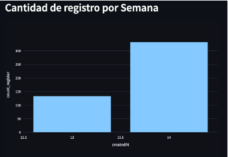
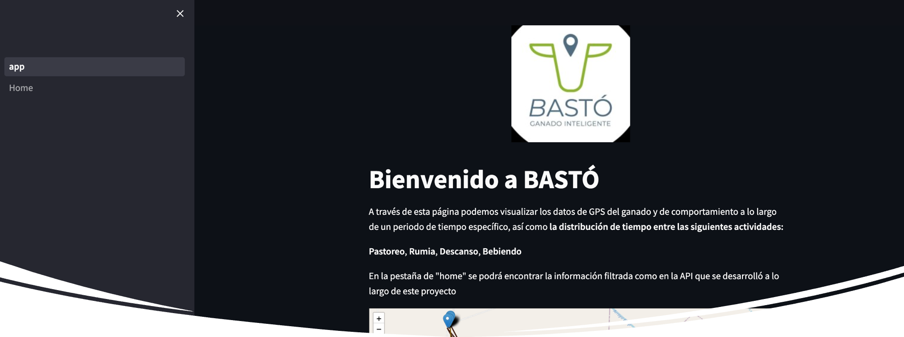
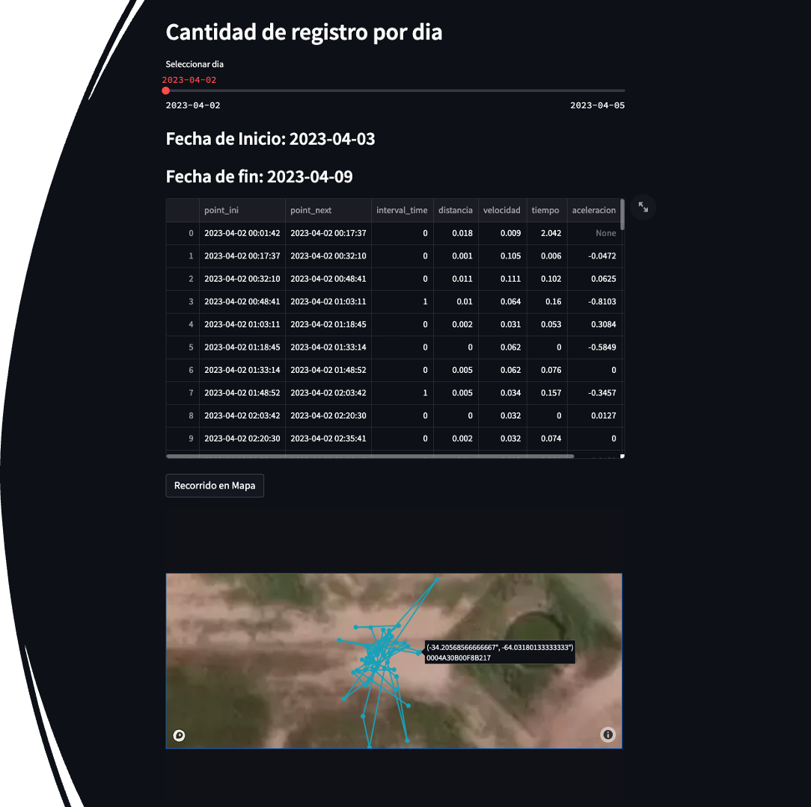
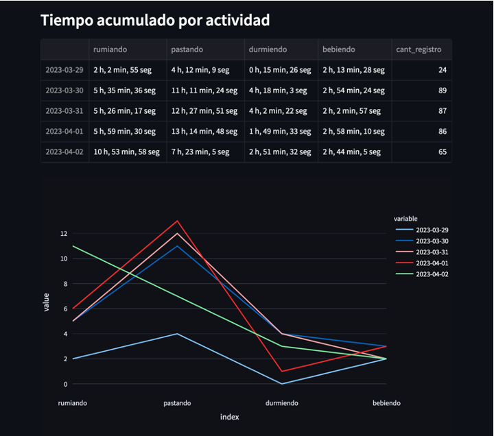
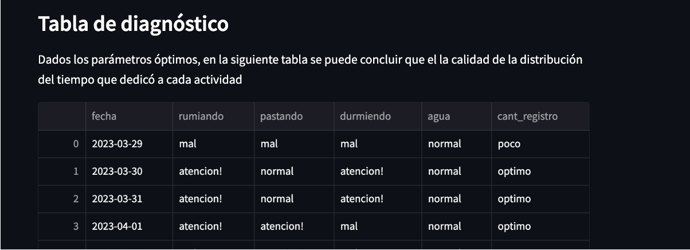

  

 

# PROYECTO GRUPAL - BASTÓ Ganado inteligente #

 

#  Start-Up BASTÓ

__BASTÓ__ es un StartUp que apuesta por la transformación de la ganadería. Han desarrollado una cerca virtual dinámica que, a través de un collar inteligente, emite estímulos inocuos, cuidando el bienestar animal, contiene y arrea al ganado de un corral a otro gestionando un pastoreo eficiente, sustentable y de precisión. 

Los dispositivos implementados en la empresa son los siguientes: 

__Collar__ → Éstos tienen una comunicación con centro de procesamiento de datos. Proveen información sobre localización cada 15 min, además de percibir la señal RSSI (decibeles) de las caravanas.

__Caravana__ → Proveen información de vacas cercanas a través de la proximidad al collar.

 

La tecnología utilizada en los dispositivos es: 

__Plataforma GPS__ → Datos geolocalización para conocer ubicación, desplazamiento y estimación de forraje.

__Plataforma BLE__ → Comportamiento animal.

 

# __Henry Project__ 

 

*Objetivo:*

A través de datos GPS y  información del ganado, determinar patrones de comportamiento de las vacas, a partir de los horarios, localización y índice de temperatura y humedad (ITH).

 

### Tareas a desarrollar:

* Investigación sobre comportamiento de ganado y los factores que pueden intervenir en el mismo. 
* Conexión con base de datos proveída.
* Limpieza y extracción de datos relevantes para su análisis 
* Exploración sobre distribución de los datos, valores nulos y duplicados.
* Visualización de puntos GPS.
* Creación de funciones para realizar consultas a la base de datos. 
* Deployment para visualización de consultas.

 

### Stack Tecnológico utilizado:

* MongoDB
* Python con librerias geopy, pymongo, pandas, geopandas, shapely, folium.
* Streamlit 
* Jira 
* Confluence 

 

## Investigación 

 
En general, las vacas tienen una distrución de 8 hrs en cada una de estas actividades: descanso, pastoreo y rumia. Sin embargo la distribución de estos tiempos depende de varios factores, entre los cuales destaca la calidad del pasto, condiciones climáticas, la ubicación de fuentes de agua y suplementos y la topografía del terreno.

En los datos que pudimos tener acceso se tenían 3 principales alimentos: centeno, grama rhodes y soja. La calidad de cada uno de ellos varía y puede impactar en la ingesta calórica por día. 

* En cuanto al valor energético del centeno en bovinos  se encontró que tiene una Energía Metabolizable (EM) de 2.8 Mcal por Kg de masa seca, bajo porcentaje de grasa (<1.5%) y aporta 9% de proteína 

* Grama Rhodes aporta 5.25% de proteína bruta con una digestibilidad de 43%. Además de aportar 1.7 Mcal por Kg de masa seca.

* En el caso del rastrojo de soja aporta 6.5% de proteína y es la opción cuando hay sequías. Tiene poco aporte nutricional pero es más fácil de mantener.

El tiempo que pasan las vacas en un espacio pastoreando nos puede dar un indicador de la calidad del alimento. A mayor tiempo en el espacio menor calidad y visceversa. 

 

En cuanto a las condiciones climáticas hay que tener en cuenta que cuando se registran temperaturas altas, los animales pastorean más en la noche que de día, además de registrarse una menor ingesta de alimento. 

Aproximadamente las vacas toman en promedio unos 20 litros diarios, en unas 4 veces al día. En temporada de altas temperaturas. Esto se ve modificado dependiendo de cuando el ganado se encuentra en pasturas jóvenes, pues contienen más agua que las pasturas de más edad. Es importante ubicar las zonas de aguadas también como una referencia para conocer las necesidades de la vaca si pasa mucho tiempo en el lugar donde obtiene agua. 

 

En un estudio se observó que las conductas que más se observaban en un ganado eran: Pastoreo, Rumiación, Descanso en el pasto y estar paradas sin hacer algo relevante. Por lo tanto el tiempo que pasan en cada situación puede ayudarnos a predecir patrones en los que se mueve el ganado asociado a la localización de GPS que nos proporcionan los collares. 

 

## Visualización de datos 

 

Los datos GPS proveído por los collares es almacenado en una base de datos no relacional llamada MongoDB en la cual se van guardando documentos con información sobre las vacas, las caravanas con su señal en decibeles (RSSI), indicador ITH (Indicador de Temperatura Humedad), los asentamientos con sus límites establecidos, los dispositivos que se encuentran en funcionamiento para poder obtener más datos sobre el desplazamiento del ganado. 

 

Para manipular y visualizar los datos de manera más efectiva, se realizó una conexión con Python. Una vez que se tuvo la conexión se realizó una limpieza de los datos extrayendo la información relacionada a la localización de los collares en un potrero, quitando valores nulos o faltantes. La siguiente imagen muestra la localización de los puntos de GPS de 1 collar durante un día.

 

 

 

Sin embargo la cantidad de registro por dispositivo no era constante a lo largo del periodo de tiempo que se manejaba en la base de datos con la que se estaba trabajando, por lo que se optó por filtrar y visualizar a manera de gráfico de barras la cantidad de registros por semanas en el periodo proporcionado por lo que podría ser una guía sobre qué datos localizar para tener una mejor aproximación a las inferencias de los patrones que en conjunto las vacas realizan. 

Las semanas 13 y 14 son las que tienen la mayor cantidad de registros dentro de las vacas posicionadas en el potrero seleccionado anteriormente. En la siguiente imagen podemos ver en la primera gráfica de barras las semanas en las que un collar tiene registros y dentro de esa semana, en el segundo gráfico podemos visualizar en barras la distribución de registros a lo largo de los días dentro de la semana seleccionada en el filtro previo. 

Es importante aclarar que la cantidad de datos a lo largo del año varía dependiendo del collar, el asentamiento y las fechas marcadas. Hubo días con una buena cantidad de registros y gracias a esta cantidad robusta de información se podían realizar mejores predicciones como más adelante se aclarará. 

 

 

 

## Funciones y consultas en Deployment: API & Streamlit 

 

Una vez teniendo la exploración inicial, proceso que se puede observar en el jupiter notebook de nombre __'ETL_datos.ipynb'__, se crearon funciones que realizan consultas a la base de datos extraida de MongoDB para conocer diferentes características del comportamiento del ganado durante el día y observar datos filtrados dependiendo del asentamiento, collar y en un tiempo en específico.

A partir de esas funciones se construyó una API, una interfaz de programación, que provee al usuario la comodidad de realizar consultas a la base de datos. Las consultas arrojan datos en json que se disponibilizaron para acotar las necesidades de la empresa fueron:

 

* Primer consulta: Informacion propia de una asentamiento.

* Segunda consulta: Informacion propia de una asentamiento en un periodo de tiempo.

* Tercera consulta: Toda la informacion de una vaca de un establecimiento.

* Cuarta consulta: Toda la informacion de una vaca, en un establecimiento en una fecha.

* Quinta consulta: Toda la informacion de una vaca, en un establecimiento en un rango de fecha.

* Sexta consulta: La conducta de una vaca un día. 

* __Séptima consulta:__ La conducta de la vaca en un periodo de tiempo. 

* __Octava consulta:__ Días con más registros de una vaca en un establecimiento. 

 

Para reducción de información, se limitó el código de la API para solo mostrar las últimas dos consultas para tener un acceso directo a las consultas de interés y objetivos del trabajo: 

 

 

Los pasos a seguir para echar a andar la FastAPI teniendo el código clonado serían los siguientes: 

1) Localizarse dentro de la carpeta de app dentro del repositorio con el comando en terminal: 
    
        cd app

2) Una vez en la carpeta, en terminar se llama a la función de uvicorn de la siguiente forma: 

        uvicorn main:app --reload

3) Esto desplegará en terminal un deploy local con las consultas contenidas en el archivo main.py. Se debe dar click en el link que se produce y se visualizará en el explorador la API.

4) Otra forma de realizarlo es descomentando la última parte del código y correrlo desde el archivo en sí. 

Para realizar la consulta en el primer campo se debe poner el nombre del asentamiento a consultar, seguido del Id del collar de interés y la fecha con el siguiente formato: AAAA-MM-DD. Esto desplegará la consulta en formato json para su visualización y futura utilización.

En la segunda consulta se obtiene la misma información solo que en un periodo de tiempo específico a considerar. El formato de fecha en ambos campos de inicio y fin se debe ingresar de la misma forma en la que se especificó previamente. 

Sin embargo queda en el código de la API comentadas las otras consultas en dado caso de que sean utilizadas por el equipo de la empresa. 

 

En el siguiente link se puede observar el deploy de la visualización de las funciones elaboradas para la API con Streamlit:

 

[Consultas BASTÓ](https://nestor1608-prueba-mongo-deploy-app-56n56m.streamlit.app/Home)

 

 

En la página, en la pestaña de __'Home'__ podemos observar:

* Los filtros por asentamientos, por collar por medio de sus identificadores directos en la base de datos.
* Selección de la semana en la que se tienen registro. 
* Selección del día de interés.

Y dados esos filtros se muestra un mapa localizando las ubicaciones y los siguientes datos del día especificado punto a punto de cada toma de datos de GPS: 

* Distancia recorrida.
* Velocidad de movimiento.
* Tiempo.

 

 

## Conducta de la vaca 

 

Con la información filtrada, se construyó un modelo de K-means para agrupar datos para determinar las actividades de la vaca con collar GPS tomando en cuenta el análisis punto a punto mostrado en el Dataframe previo, los datos de:

* Distancia recorrida
* Velocidad
* Aceleración 

 

 

Además de determinar el tiempo que la vaca estaba en un rango cercano a la localización de la aguada. Se realizó un conteo de las veces que se iba a las aguadas con las horas del día en las que estaba cerca para poder encontrar relaciones entre los picos de actividad y la ida a las aguadas. 

  

 

Para concluir, incluimos una tabla al final de diagnóstico en la que se menciona la cantidad de registros obtenidos en la semana seleccionada y, dependiendo de los parámetros esperados conocida por la literatura, la clasificación del tiempo acumulado en cada una de las actividades, para que se señalara si estan dentro de la norma, si tienen una ligera tendencia fuera de la norma o si queda totalmente fuera de los parámetros. 

 

 

El código utilizado para crear este deployment se encuentra en el siguiente repositorio: 

[Streamlit](https://github.com/nestor1608/prueba_mongo_deploy)

 

Para finalizar, queremos agradecer la oportunidad de poder trabajar en una empresa de este nivel y poder aportar al trabajo del manejo de los animales, procurando su bienestar y la mejora de los procesos alrededor de ellos. 

 

## Contacto de Equipo de trabajo 

| Miembro  | Github | Linkedin |
| ------------- | ------------- | ------------- |
| Renzo Marcelo Sosa  | https://github.com/Renzo96 | https://www.linkedin.com/in/renzo-sosa-marcelo-87506a14a/ |
| Franco Jose Ariel Laborde | https://github.com/FrancoJALaborde | https://www.linkedin.com/in/franco-jose-ariel-laborde-61a7a6206/ |
| Nestor Javier Gentil | https://github.com/nestor1608 | https://www.linkedin.com/in/nestor-gentil/ |
| Brandon Andrei Albornoz Lizarazo | https://github.com/AndreiGatoCB | https://www.linkedin.com/in/brandon-andrei-albornoz-lizarazo/ |
| Ariatna Hernández Castillo | https://github.com/Arii95 | https://www.linkedin.com/in/ariatna-hernandez-/ |

